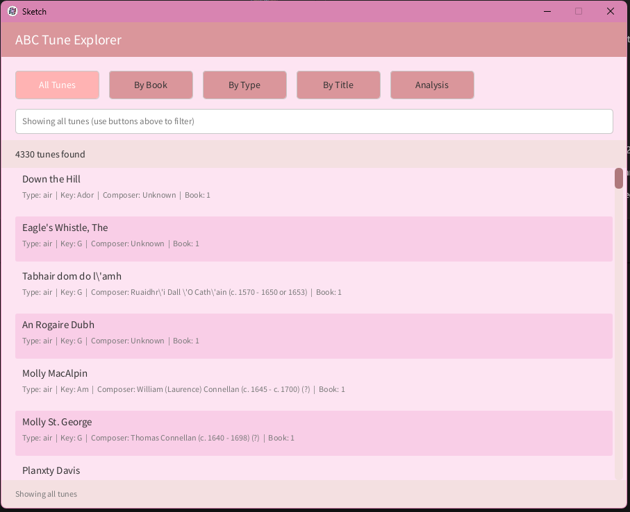
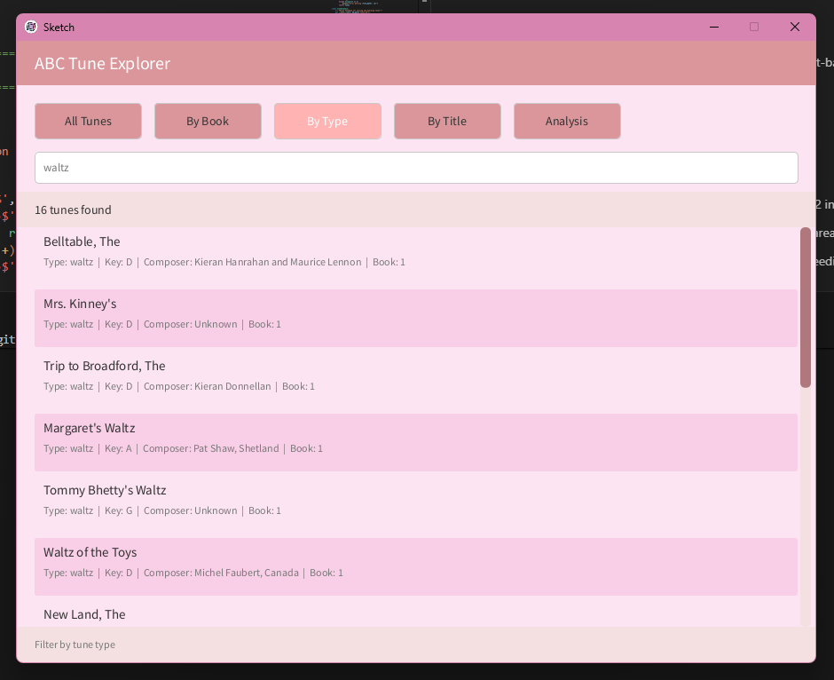
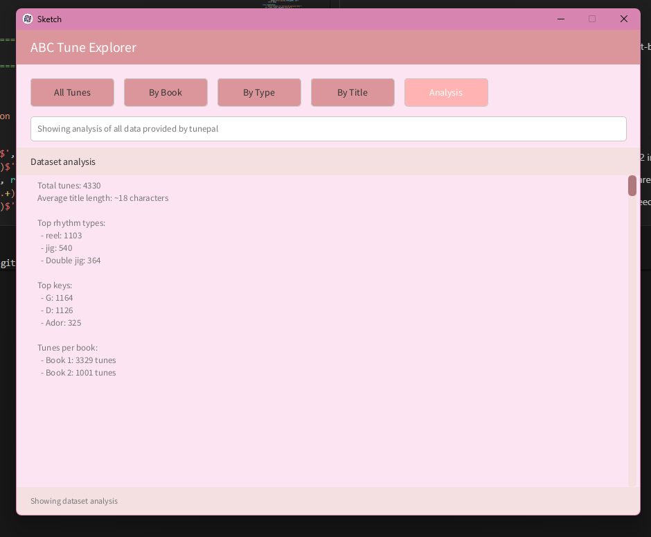

# Data Centric Programming Assignment 2025

## Module Information

Module: Data Centric Programming 
Course: TU850/2

Project Title: ABC Tune Explorer 

Lecturer: Bryan Duggan

Name: Karla Satrapova

Student Number: C24744861


# Description of the project

This project is an "Tune Explorer” built in Python using py5 for the graphical interface, SQLite as the database, and pandas for data analysis. The program reads traditional music tunes from `.abc` files, stores them in a `tunes` table, and then lets the user browse, filter, and analyse the collection through a custom pink-themed UI.

Users can:
- View all tunes loaded from the `abc_books` folder
- Filter tunes by book number, rhythm type, or partial title match
- Switch to an Analysis mode that shows simple statistics about the dataset

The main focus of the assignment is combining file parsing, databases, dataframes, and a UI into one coherent application.

# Instructions for use


1. **Run the program**

From the project folder, run: python PROJECT.py

2. **Using the UI**

 At the top, there are five buttons:

 - All Tunes – show the full dataset
 - By Book – filter by book number
 - By Type – filter by rhythm type
 - By Title – filter by (partial) title
 - Analysis – show dataset statistics

  In *Book / Type / Title* modes, type your query in the search box and press Enter.
 
  Use the mouse wheel or the vertical scrollbar on the right to scroll.

# How it works:

### 1. Parsing ABC Files

The `ABCParser` class is responsible for parsing `.abc` files:

-  I chose to use compiled regular expressions because they're fast and ABC notation has a consistent structure:

- `T:` for title
- `R:` for rhythm type
- `K:` for key
- `C:` for composer
- `S:` for source

- The parsing process:
	- Reads the whole file and splits on `X:`  (the tune index) turned out to be much cleaner.
	- extracts metadata for each block and builds a dictionary with title, rhythm type, key, composer, source, book number, file name, and the raw content
	- Handles missing fields by setting them to `"Unknown"` or `None` where appropriate.

Any parsing errors are caught and printed so a bad file does not crash the whole run.

### 2. Inserting Tunes into SQLite

The `TuneDatabase` class wraps all database operations:

- On initialisation it connects to `tunes.db` and creates the `tunes` table if it does not exist
- The `insert_tunes` method loops over the dictionary list and inserts each tune with a parameterised `INSERT` query
- The `get_dataframe` method reads all rows into a pandas DataFrame ordered by `id`.

In the main block:

- The program explicitly executes `DELETE FROM tunes` before re-inserting, so repeated runs don’t duplicate data
- This was originally a subtle bug: the tune count kept increasing until it became clear that the table was never cleared between runs.

### 3. DataFrame Filtering

Once data is in the database, I load it into a pandas DataFrame with pd.read_sql():

- `get_tunes_by_book(df, book_number)`  # Exact match on book_number
- `get_tunes_by_type(df, tune_type)`    # Case-insensitive partial match
- `search_tunes(df, search_term)`       # Case-insensitive title search

The `str.contains()` method with `case=False` is perfect for fuzzy matching - users can type "jig" and it finds "Jig", "JIG"
I added `na=False` to handle missing values safely - otherwise pandas throws errors on None values.
`get_filtered_tunes()` chooses what to return based on the global `query_mode` and `query_value`, so the rest of the UI only has to consume a filtered DataFrame.

### 4. py5 UI and Interaction

The UI is done entirely in py5, using a manual layout:

- `setup()` creates a 900×700 window with a pink background
- `draw()`:
- Clears the background
- Draws the header and title text
- Draws the row of filter buttons
- Draws the search input line with a context-dependent placeholder
- Calls `draw_results_list()` to show either the tune list or the analysis text
- Draws a custom scrollbar and a footer status bar

The tune list:

- Uses a clipping region so only visible items are drawn
- Alternates row colours for readability
- Shows title on the first line and metadata (Ttpe, key, composer, boook) underneath
- Uses `scroll_offset` to shift the y-position of rows as you scroll.

The scrollbar (I had to build from scratch since py5 doesn't have a built in one):

- Calculates thumb size based on the ratio of visible area to total content height
- Supports dragging (tracking `is_dragging_scrollbar`, `drag_start_y`, `drag_start_scroll`)
- Supports clicking the track to jump
- Mouse wheel events adjust `scroll_offset` by `SCROLL_SPEED`

Keyboard and mouse handlers:

- `key_pressed()` updates the search string, handles backspace and Enter, and resets scrolling when the query changes
- `mouse_pressed()` detects clicks on the filter buttons and updates `query_mode`, `query_value`, `status_message`, and scroll offset. It also starts scrollbar dragging when appropriate
- `mouse_dragged()`, `mouse_released()`, and `mouse_wheel(event)` manage smooth scrolling

Optimization:
- Initially the program drew ALL tune items every frame, which got slow with all the tunes. I added a check:

```python

if y + ITEM_HEIGHT < list_y or y > list_y + list_height:
	continue  # Skip items outside visible area}
```
Now it only renders what's on screen, making scrolling smooth

### 5. Analysis Mode

The `"analysis"` query mode replaces the tune list with a text-based summary built by `get_analysis_text()`:

- It calculates:
	- Total number of tunes
	- Average title length in characters
	- Top 3 rhythm types (by count)
	- Top 3 keys
	- Tunes per book (top 2 by count, there were only 2 in the given dataset)

- It builds a multi-line string and renders it in the results area with the same styling as the list header

- It turns the explorer into a basic analysis tool without needing matplotlib or any charting library


# List of files in the project

* PROJECT Main Python script
* tunes.db SQLite database created and used by the program
* Abc_books folder from assignment
* starter_code.py from assignment
* Assignment.md from assignment
* Image folder from assignment with screenshots
* LICENSE from assignment
* .gitignore from assignment
* README.MD Project documentation


# References
- Python documentation (standard library: `sqlite3`, `re`, `pathlib`)
- pandas documentation for `DataFrame`, `value_counts`, and `str.contains`
- py5 documentation for `size`, `rect`, `text`, event handlers, and clipping
- Lecture notes for Data Centric Programming 
- erik diegel 


# What I am most proud of in the assignment

1. The scrollable UI, with a scrollbar and alternating row colours that make it easy to browse
2. The Analysis mode that turns the tune list into a small data overview

# What I learned

- Parsing ABC files and loading tunes into SQLite and pandas

- Building a UI from scratch in py5 with buttons, scrolling, and filters. which was actually fun once I understood the draw loop

- Generating simple dataset statistics from the DataFrame

- The importance of clearing database tables between runs :)

# Screenshots


- UI showing all tunes

- Example of filtering 

- Analysis mode 



